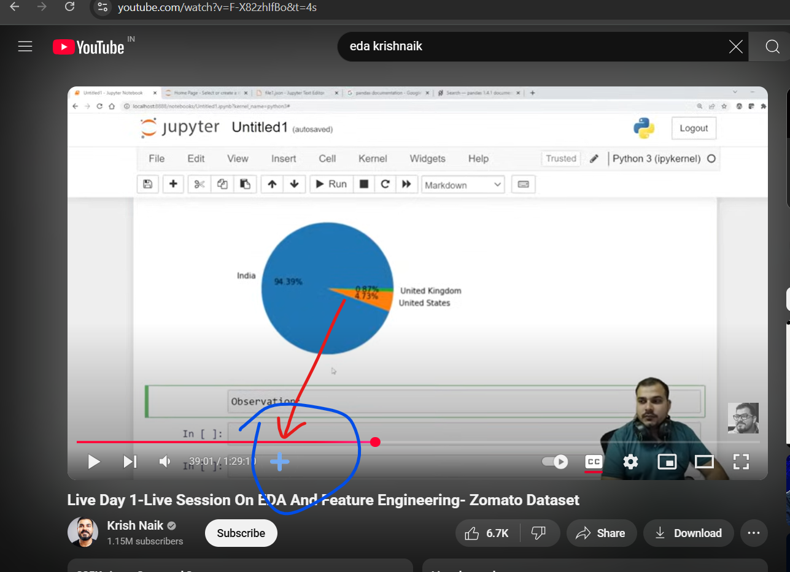

# YouTube Video Timestamps Bookmarker

A Chrome extension that allows you to bookmark specific timestamps in YouTube videos, making it easy to save and return to important moments in your favorite videos.

## Features

- 📌 **Bookmark Timestamps**: Save any moment in a YouTube video with a single click
- 📋 **View Bookmarks**: See all your bookmarks for the current video in a clean, organized list
- ▶️ **Quick Navigation**: Jump directly to any bookmarked timestamp with one click
- 🗑️ **Easy Management**: Delete bookmarks you no longer need
- 💾 **Persistent Storage**: Your bookmarks are saved and will be there when you return to that video

## 📸 Screenshots

<div align="center">
 
  <p><em>Extension popup showing saved bookmarks</em></p>
  
  
  <p><em>Bookmark button in YouTube video controls</em></p>
 
</div>

## Getting Started in Chrome

1. **Download the Extension**:
   - Click the "Code" button on this repository
   - Clone this repository or download the source code
   - Extract the downloaded folder if it is zip file

2. **Add to Chrome**:
   - Open Chrome and type `chrome://extensions/` in the address bar
   - Turn on "Developer mode" (toggle in the top right)
   - Click "Load unpacked" and select the extracted folder
   - The extension icon will appear in your Chrome toolbar

3. **Start Using**:
   - Open any YouTube video
   - You'll see a bookmark button in the video controls
   - Click the extension icon anytime to view your bookmarks

## How to Use

1. **Adding a Bookmark**:
   - Play any YouTube video
   - Click the bookmark button in the video controls when you reach a moment you want to save
   - The timestamp will be automatically saved

2. **Viewing Bookmarks**:
   - Click the extension icon in your Chrome toolbar
   - See all bookmarks for the current video
   - Each bookmark shows the exact timestamp

3. **Using Bookmarks**:
   - Click the play button next to any bookmark to jump to that timestamp
   - Click the delete button to remove a bookmark

## ⚙️ Tech Stack / Technical Details

Uses Chrome Extension APIs including:
- `chrome.storage` – for persistent storage of bookmarks
- `chrome.runtime` – to enable messaging between background, content, and popup scripts
- `chrome.tabs` – to interact with and retrieve information about browser tabs
- `chrome.scripting` – to inject content scripts dynamically (Manifest V3)

JavaScript – Core scripting logic for background and content scripts
Manifest V3 – Extension manifest file format used
DOM Manipulation – Inject bookmark button, control YouTube player
YouTube Video DOM Access – Using class selectors like .video-stream, .ytp-left-controls
- Uses Chrome's storage API for persistent bookmark storage
- Clean, modern UI with intuitive controls

## Files Structure

```
youtube-bookmark-extension/
│
├── assets/               # Bookmark icon and images
├── background.js         # Background script handling events
├── contentScript.js      # Injected script for interacting with YouTube
├── popup.html            # Extension popup layout
├── popup.js              # Popup functionality
├── utils.js              # Utility functions
├── popup.css             # Styling for popup
└── manifest.json         # Extension metadata and permissions
```

## Permissions

- `storage` - To save and retrieve bookmarks
- `tabs` - To interact with YouTube tabs
- `https://*.youtube.com/*` - To access YouTube videos

## �� Known Issues

- **Bookmark Deletion Bug**: 
  - When deleting any bookmark (except the last one), two bookmarks get deleted:
    - The selected bookmark
    - The last bookmark in the list
  - Deleting the last bookmark works as expected
  - This is a known issue that needs to be fixed. Contributions to resolve this issue are welcome!

## 🤝 Contributing

Suggestions and improvements are welcome! Feel free to fork the repo, make changes, and open a pull request.

## License

This project is open source and available under the MIT License. 